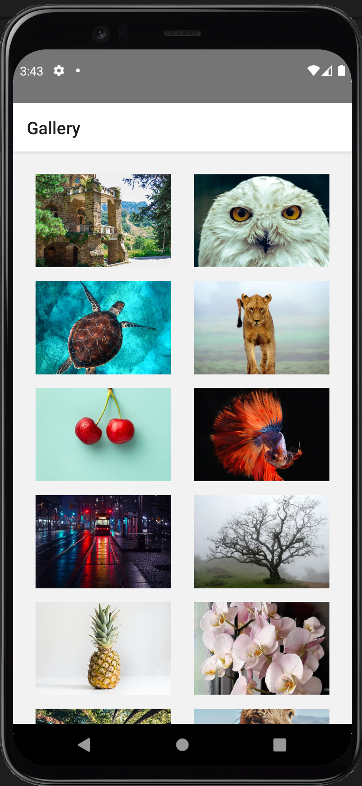
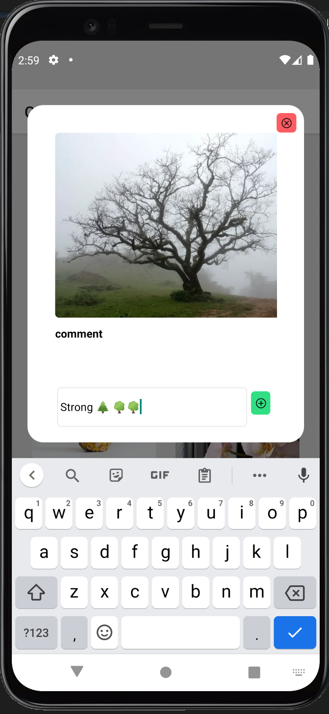
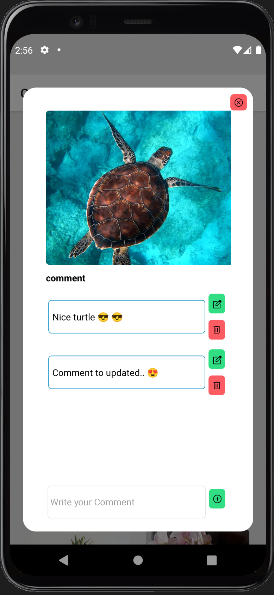

# SONIQ

## Main technologies used

- React Native
- Typescript
- react-query
- styled-components
- React Native Testing Library
- React Navigation

## Main functionality

- Gallery Page contain list of Images.
- User can scroll with down through the photos list
- User can click on Image and see a modal that have i bigger version of the image + comments.
- User can Consult, Add , Update, Delete Comments.

## Prerequisites

- React Native CLI to be installed. You can install it by running the command:

`npm install -g react-native-cli`

- Simulator or emulator to run the app on.

### Installation

First clone the repo using `SSH` or `HTTPS`.
Here's an example using `HTTPS`:

`git clone https://github.com/MMelek00/Soniq.git`

Second run the following command to install project dependencies:

`yarn install`

**in IOS**

You will need to make one more step to install pods dependencies, run the following command in the project directory:

- `cd ios && pod install`

### Run on Device

- run `yarn android` or `yarn ios` to run on device or emulator.

### Run Unit Test

- run `yarn run test` to run all unit test suites.

## Screenshots

  
  
  

